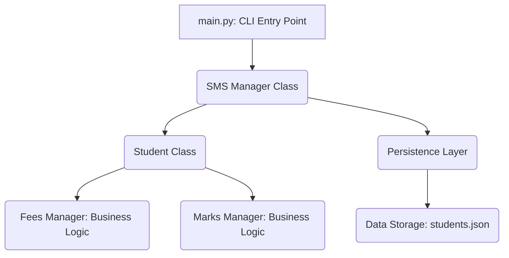

# 🚀 Core Python Engineering Fundamentals — WEEK 1 COMPLETE (7/7 Projects)


Short summary
-------------
This repository documents a focused 7-day engineering sprint that transforms core Python knowledge into deployable, test-driven, modular applications. The projects emphasize data structures, file I/O, and object-oriented programming (OOP), with an emphasis on maintainability and testability.

Execution summary
-----------------
- Duration: 7 days (structured sprint)
- Mini-projects delivered: 7 (end-to-end, modular)
- Engineering focus: OOP, persistence (TXT/CSV/JSON), data structures & algorithms (DSA), CLI architecture
- Quality standards: PEP8, type hints, docstrings, and unit tests where applicable

Why this matters
----------------
This codebase demonstrates practical engineering skills beyond small exercises:
- Modular design for building testable Python systems
- Practical OOP (inheritance, polymorphism) via the Student Management System
- Fault-tolerant file-based persistence layers (TXT, CSV, JSON)
- Robust CLI applications using native Python I/O
- Unit-test-driven development to validate business logic and persistence

Mini-project gallery (7 completed)
---------------------------------
| Project | Core skill focus | Engineering value | Link |
|---|---:|---|---|
| CLI Calculator | I/O, error handling, functions | Fault-tolerant utility | [mini_projects/day1_cli_calculator](mini_projects/day1_cli_calculator) |
| Word Frequency Counter | DSA (dicts/sets/lists) | Text analysis pipeline | [mini_projects/day2_word_counter](mini_projects/day2_word_counter) |
| Pattern Generator | Control flow & algorithms | Algorithmic logic | [mini_projects/day3_pattern_generator](mini_projects/day3_pattern_generator) |
| Utility Toolkit (`utils.py`) | Modularity, reusability | Internal shared library | [mini_projects/day4](mini_projects/day4) |
| Notes App (CRUD) | File persistence (TXT) | Simple persistent notes | [mini_projects/day5_cli_notes_app](mini_projects/day5_cli_notes_app) |
| Student Management (Part 1) | OOP, CSV/JSON persistence | Data modeling & storage layer | [mini_projects/day6_student_portal_p1](mini_projects/day6_student_portal_p1) |
| Advanced Student Management (Part 2) | Inheritance, advanced OOP | Complex business rules | [mini_projects/day7_student_portal](mini_projects/day7_student_portal) |

---

## 💻 SECTION 5: Installation & Execution

### 5.1 Prerequisites

All code is written for **Python 3.x**. Using a virtual environment is strongly recommended for dependency isolation.

### 5.2 Environment Setup

```bash
# 1. Create a virtual environment
python3 -m venv venv

# 2. Activate the environment (macOS / Linux)
source venv/bin/activate

# 3. Activate the environment (Windows PowerShell)
.\venv\Scripts\Activate.ps1

# 3b. Activate the environment (Windows cmd)
.\venv\Scripts\activate
```

### 5.3 Local Execution

Clone the repository and run any mini-project directly from the terminal.

```bash
# 1. Clone the repository
git clone https://github.com/vinay-2006/python-fundamentals.git
cd python-fundamentals

# 2. Example: Run the Advanced Student Management System
python mini_projects/day7_student_portal/main.py
```

---

## ⚙️ SECTION 6: Project Showcase - Student Management System (Day 7)

The culminating project demonstrates a complex, multi-state system built on modern OOP principles.

Architecture Diagram: Composition vs. Inheritance  
The system is designed with a clear separation of concerns, showing how domain logic is managed by specialized classes.

Code snippet (architecture diagram)



Live Demonstration (CLI Output)  
The screenshot below shows the live functionality of the system, including adding a new student and viewing the updated record.

---

📚 SECTION 7: Repository Architecture

The project structure enforces clean separation between daily training exercises and final modular applications.

| Path | Category | Purpose | Content Status |
|---|---|---|---|
| /mini_projects | Integrated Applications | "Home for all 7 end-to-end applications, each with its own folder." | 7 Projects Completed. |
| /practice | Daily Training | "Individual solutions and scripts for fundamental exercises (DSA, Patterns, HackerRank)." | Complete. |
| .github/workflows | CI/CD | Designated folder for Continuous Integration pipelines and automated quality checks. | Ready for integration. |
| .gitignore | Configuration | "Ensures clean version control by excluding binaries, cache files, and environment secrets." | Complete. |

Testing
-------
Run unit tests (where present):

```bash
python -m unittest discover -s tests
```

or run individual test files:

```bash
python -m unittest tests.test_example
```

Notes & best practices
----------------------
- Data files such as `notes.txt` or `students.json` are generated at runtime and should be ignored by git (.gitignore).
- Each mini-project includes a README with usage and tests (see each project's folder).
- Follow PEP8, add type hints, and write tests for any new module you add.

License
-------
MIT License — see LICENSE file

Contributing
------------
Contributions and improvements are welcome. Open an issue or submit a pull request with clear descriptions and tests for new features or bug fixes.

Contact
-------
Maintainer: vinay-2006
